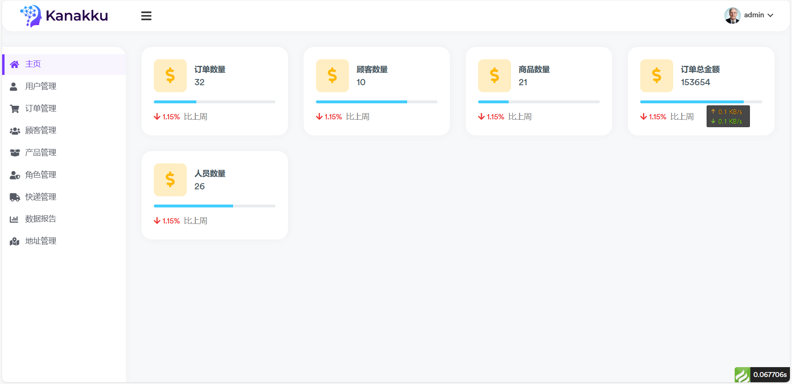
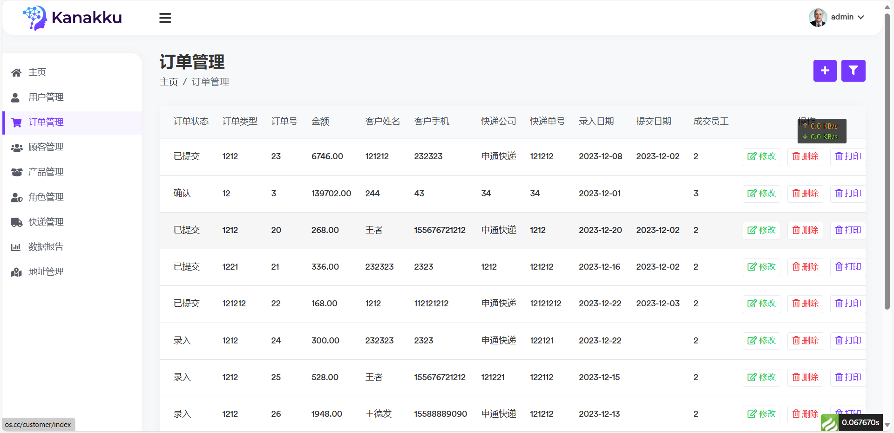
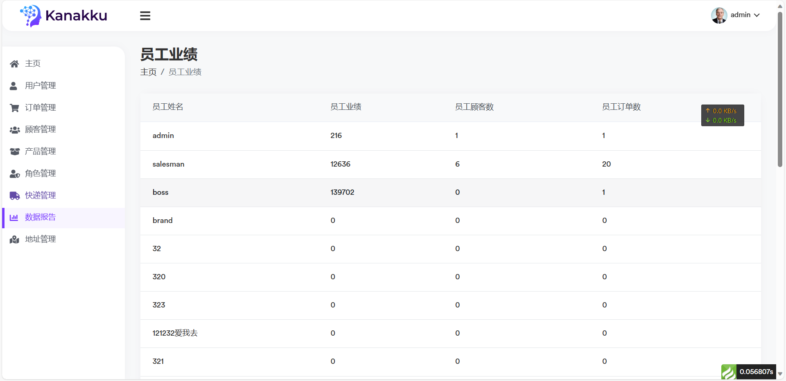
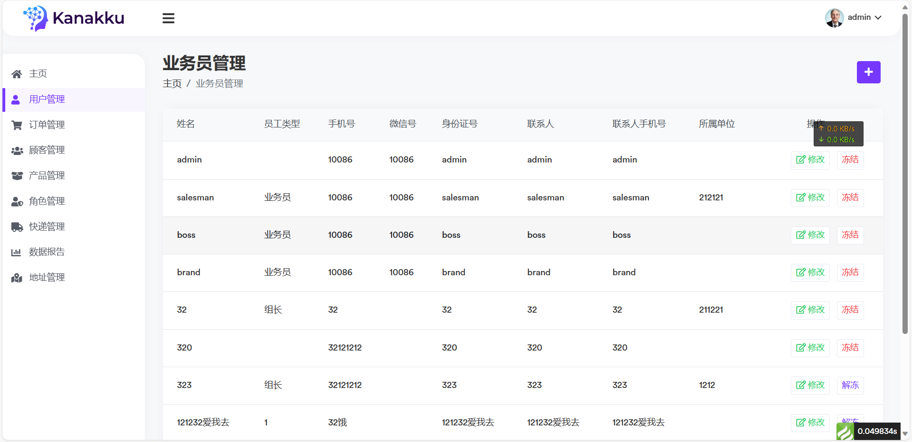

OA 基于ThinkPHP 6.0开发的虚拟商品管理系统 
===============

**运行环境要求**

> PHP7.2+
> MySQL5.7+

## 主要功能

* 首页
* 客户管理
* 商品管理
* 角色管理
* 顾客管理
* 

## 多角色

* 超级管理员
* 老板
* 业务员
* 品牌方

## 安装

~~~
composer create-project topthink/think tp 6.0.*
~~~

如果需要更新框架使用
~~~
composer update topthink/framework
~~~

## 文档

## 效果图

